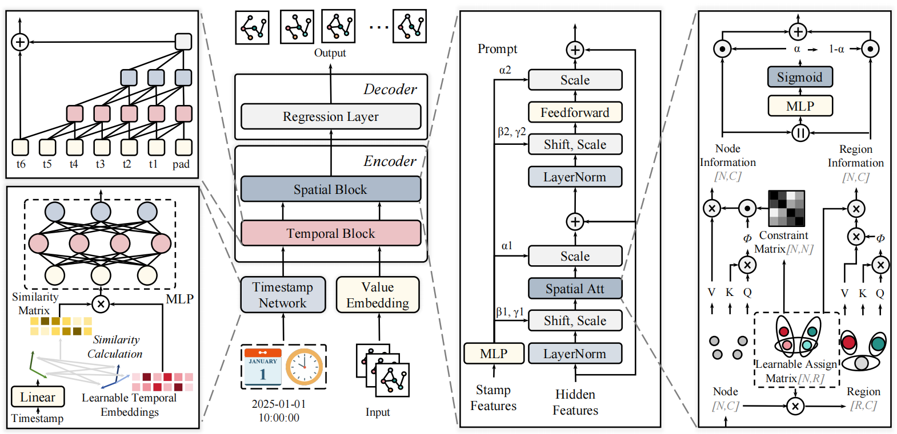

# STTP
This is the pytorch implementation of STTP.



## Requirements

## Datasets

## Train Commands
To run STTP, you may directly execute the Python file in the terminal.Here are some examples:
```
aaaaa
```

## Results

