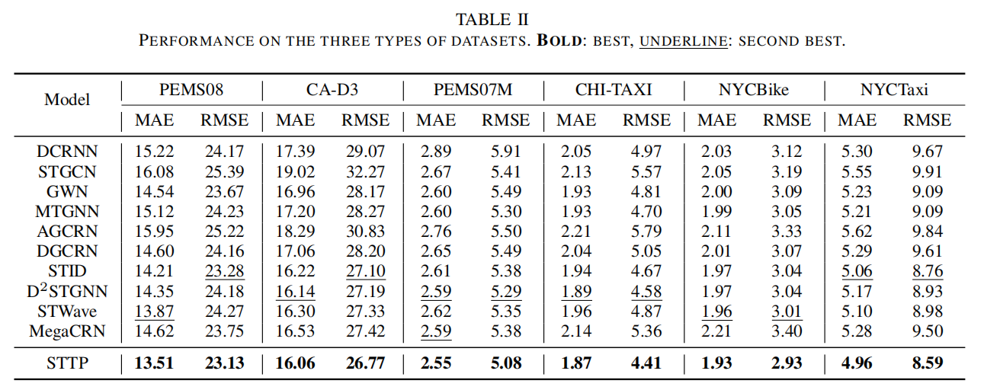

# STTP
This is the pytorch implementation of STTP. 


## Requirements
The code is built based on Python 3.9.0, PyTorch 1.11.0, and NumPy 1.24.4.
## Datasets
Preprocessed datasets are available in [OpenCity](https://github.com/HKUDS/OpenCity.) (including PEMS08, CA-D3, PEMS07M, CHI-TAXI, NYCBike, and NYCTaxi).
## Train Commands
To run STTP, you may directly execute the Python file in the terminal. Here are some examples: 
### PEMS08
```
nohup python -u train.py --data PEMS08 --channels 256 > PEMS08.log &
```
### CHI-TAXI
```
nohup python -u train.py --data CHI_TAXI --channels 128 > CHI_TAXI.log &
```
## Results

